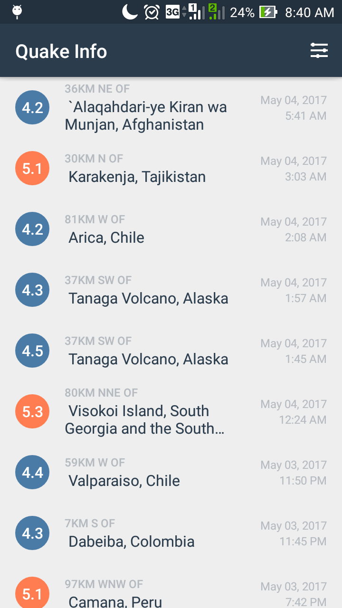

# QuakeInfo
An Aplication for detecting an earthquake around the world. All the data are taken from [ API USGS](https://earthquake.usgs.gov/fdsnws/event/1/

You probably need QuakeInfo as an application for people to know latest earthquake happened around the world.


## Install

```
$  git clone https://github.com/naiborhujosua/QuakeInfo.git
```

```
Download [Android Studio](https://developer.android.com/studio/index.html) for building mobile application
```

```
Import the project
```

## Features
```
1. Giving notification to the user while there is any tsunami based on the size of the earthquake
```
```
2. Automatically linked to the website of the USGS 
```
```
3.Choose the most recent earthquake
```
```
4.Sort the size of the earthquake
```


